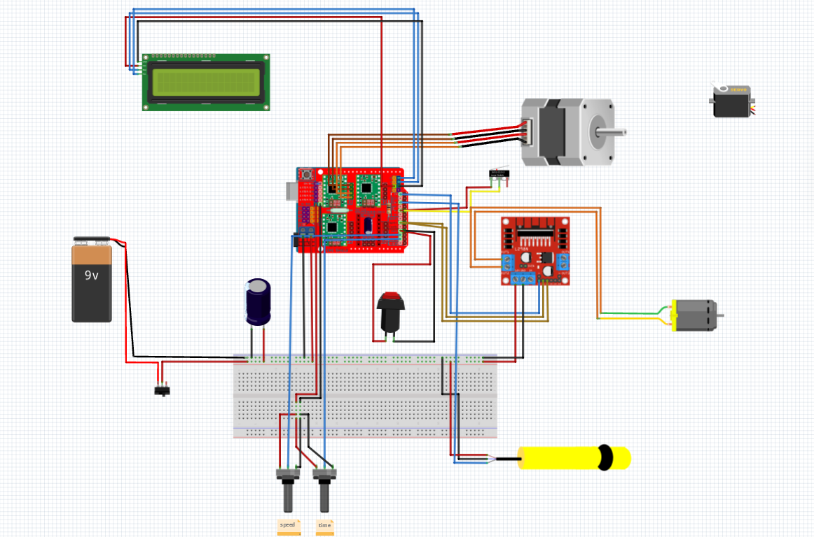

# Máy Chiết Artemia

Máy chiết chiết tự động cho artemia (tôm muối) với kiểm soát thể tích chính xác và giám sát thời gian thực.

## Vấn Đề

Chiết chiết ống tube thủ công cho artemia tốn thời gian và không nhất quán. Mỗi ống cần liều lượng chính xác 5ml với xác nhận trực quan, và việc theo dõi số lượng ống trong quá trình xử lý là rất quan trọng để kiểm soát chất lượng.

## Giải Pháp

Hệ thống chiết tự động dựa trên Arduino:
- Chiết ống với thể tích tự động dựa trên cài đặt thời gian
- Đếm số ống đã chiết bằng cảm biến quang điện
- Hiển thị tốc độ, thời gian bơm và số lượng ống thời gian thực trên LCD
- Điều chỉnh tốc độ bơm và thời gian chiết trực tiếp bằng 2 biến trở độc lập
- Hỗ trợ hủy quá trình khẩn cấp (Abort) bằng nút bấm cứng

## Linh Kiện

| Linh Kiện | Công Dụng |
|-----------|-----------|
| Arduino CNC Shield V3.00 | Board điều khiển chính |
| L298N DC Motor Driver | Điều khiển tốc độ/chiều motor bơm |
| Nema 17 Stepper Motor | Truyền động cơ cấu xoay |
| LCD 16x4 I2C (PCF8574) | Hiển thị trạng thái và thông số |
| Cảm Biến Quang (E3F-DS30C4) | Phát hiện vị trí ống để đếm và kích hoạt bơm |
| Công Tắc Hành Trình (JL012-13) | Nút hủy quá trình (Abort) / Homing |
| 2 x Biến Trở 10K | Điều chỉnh tốc độ bơm và thời gian bơm |
| Bơm Peristaltic 5V | Chiết dung dịch artemia |

## Máy Trạng Thái

```text
ROTATING (Xoay mâm) → SENSOR_CHECK (Kiểm tra ống)
      ├─ [Có ống] → PUMP_WAIT (Đợi ổn định 1s) → PUMP_FILL (Bơm dung dịch) → PUMP_DONE (Đợi 3s) → ROTATING
      └─ [Không ống] → NO_TUBE_WAIT (Đợi 5s) → ROTATING

* Nút Abort: Hủy quá trình đang chạy bất kỳ lúc nào và đưa hệ thống về trạng thái ban đầu.
* Bơm sẽ tự dừng nếu mất ống (rớt ống) trong quá trình bơm.
```

## Điều Chỉnh Bơm Trực Tiếp

Hệ thống cho phép điều chỉnh trực tiếp các thông số bơm thông qua 2 núm vặn:
1. **Biến trở tốc độ (Chân A1):** Điều chỉnh tốc độ quay của động cơ bơm (PWM: 0 - 255).
2. **Biến trở thời gian (Chân A2):** Điều chỉnh thời gian bơm cho mỗi ống (từ 2.0 giây đến 20.0 giây).
Mọi thay đổi đều được cập nhật thời gian thực trên màn hình LCD.

## Demo



[▶️ Xem Video Demo trên YouTube](https://youtu.be/GX13D0-sERE)

## Nhóm

- **kiến trúc sư**: ZT
- **kĩ sư**: DevShiroru